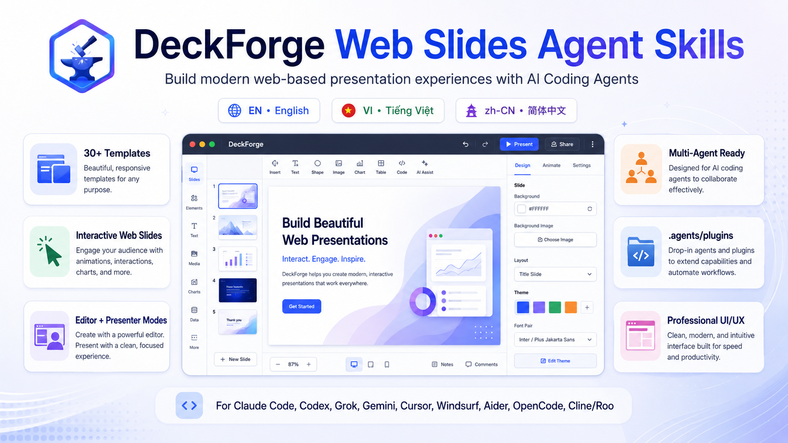
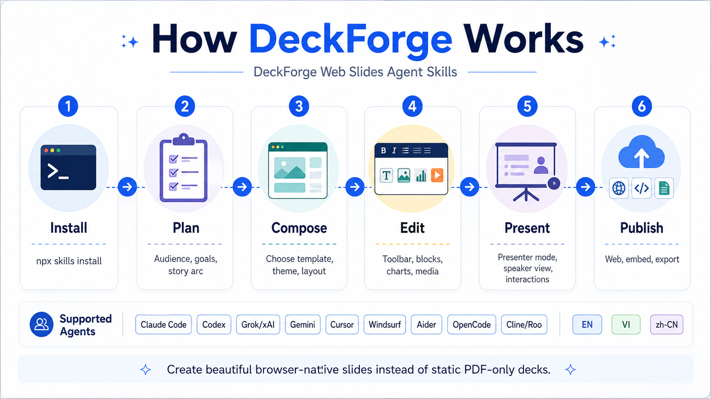
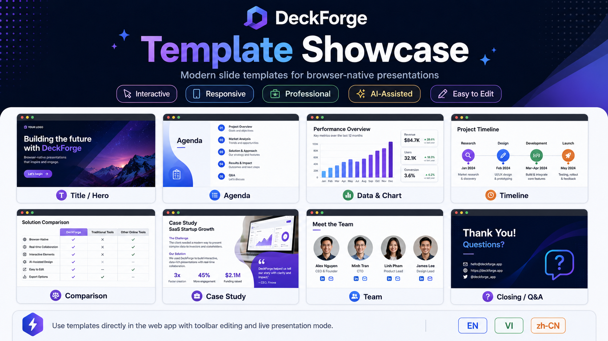
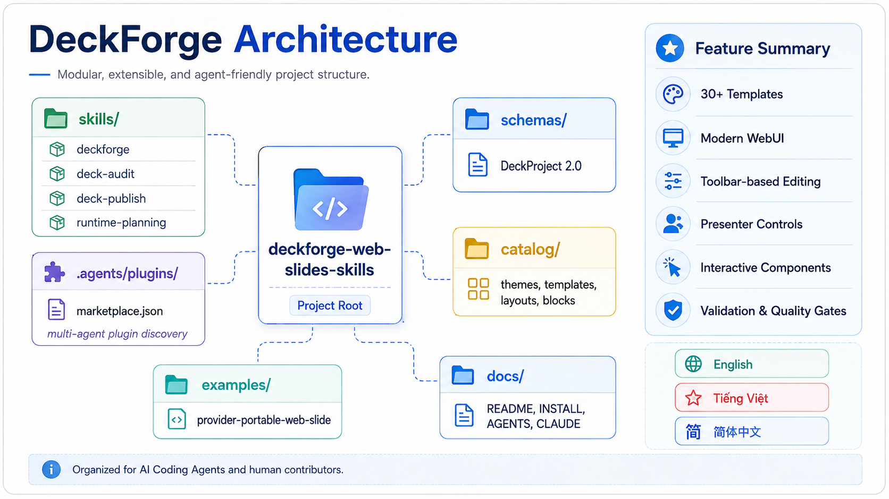

<div align="center">

# DeckForge Web Slides Agent Skills

**使用 AI Coding Agents 构建现代化、浏览器原生的演示体验。**

[English](./README.md) · [Tiếng Việt](./README.vi.md) · [简体中文](./README.zh-CN.md)

</div>



DeckForge 是一个用于规划、设计、实现、审计和发布专业 Web 演示应用的**多智能体技能仓库**。

DeckForge 不把演示文稿局限为 PowerPoint 或静态 PDF，而是指导 AI 编码助手构建完整的产品体验：结构化幻灯片模型、可复用模板、现代编辑工具栏、演讲者模式、响应式渲染、观众交互、演讲备注、嵌入以及 Web 发布。

## 为什么选择 DeckForge？

大多数幻灯片生成工具只负责生成页面。DeckForge 关注的是围绕这些页面的完整应用。

- **浏览器原生交付** — 直接在 Web 上演示、分享和嵌入。
- **编辑器与演示模式一体化** — 在同一个产品中完成设计和展示。
- **专业 UI/UX** — 统一的信息层级、间距、排版、动效和交互模式。
- **可复用系统** — 主题、模板、布局、内容块、动画和演示控制。
- **清晰的 Agent 合同** — 明确的 instructions、references、schemas、scripts 与质量门禁。
- **面向生产环境** — 将 accessibility、responsiveness、performance、security 和 validation 纳入工作流。

## 什么是 Skill？

Skill 是一个可由 AI 编码助手按需加载的独立目录。必需文件 `SKILL.md` 用来描述**何时应该激活该 Skill**以及**Agent 应如何执行任务**。

```text
<skill-name>/
├── SKILL.md          # 必需：YAML frontmatter + Agent 指令
├── README.md         # 可选：面向维护者和使用者的文档
├── references/       # 可选：按需加载的扩展资料
├── scripts/          # 可选：结果确定的可执行辅助工具
└── assets/           # 可选：schema、模板、图标及其他资源
```

`SKILL.md` frontmatter 中的 `description` 字段是 Skill 与 Agent 之间的激活合同。它应准确说明 Skill 的适用场景，避免 Agent 在无关任务中加载整个仓库。

DeckForge 遵循这一原则：主工作流保持简洁，更深入的设计、runtime、validation 和 implementation 内容放在支持文件中。

## DeckForge 如何工作？



1. **Install** — 将 Skill 仓库加入目标编码助手环境。
2. **Plan** — 明确受众、目标、叙事结构和演示场景。
3. **Compose** — 选择模板、布局、主题、内容块和内容结构。
4. **Edit** — 构建具有可预测控制和状态行为的浏览器编辑器。
5. **Present** — 支持键盘、触摸、总览、备注和演讲者模式。
6. **Publish** — 发布为 Web 体验、嵌入页面、分享路由或受支持的导出格式。

## 内置能力

| 项目 | 数量 |
|---|---:|
| Presentation template | 48 |
| Visual theme | 60 |
| Layout archetype | 36 |
| Structured block type | 33 |
| Animation pattern | 24 |
| Audience interaction pattern | 26 |
| Presenter control | 20 |
| Export contract | 6 |
| Delivery profile | 4 |
| Presentation archetype | 12 |
| Motion profile | 8 |

另外还包括：

- `DeckProject` JSON Schema
- 编辑工具栏与快捷键合同
- presenter 与 speaker view 状态模型
- 响应式布局指南
- accessibility 与 reduced-motion 要求
- chart、diagram、code、media 与 citation 模式
- React 和 TypeScript starter components
- 确定性的 validation 与 packaging scripts

## DeckForge 3 稳定性升级

DeckForge 3 直接解决 AI 生成演示应用中的常见问题：

- **语义化布局，而不是任意坐标** — 每个布局都定义命名 slot、内容预算、响应式顺序、安全边距和碰撞规则。
- **默认交付真实可编辑 Deck** — 普通幻灯片创建请求必须生成可操作编辑器，而不是带装饰性工具栏的静态 presenter。
- **完整 Tools Side Panel** — 可编辑所选 slide 或 block 的布局、主题、颜色、排版、媒体、fit、alt text 与样式。
- **可持久化编辑** — 修改会写回序列化 `DeckProject`，显示保存状态，刷新后恢复，并支持 undo/redo。
- **按演示类型生成** — pitch、executive、technical、academic、education、workshop、portfolio 与 data report 使用不同的叙事和视觉系统。
- **有目的的动效** — motion profile 包含 reduced-motion fallback、编辑器预览、可中断行为与性能规则。
- **可发现快捷键** — 编辑器和演示模式均提供可见帮助入口与 `?` 快捷键对话框。
- **确定性质量门禁** — 完成前必须通过 schema、layout、collision、capability truth、build 与关键行为验证。

运行完整参考示例：

```bash
cd examples/02-example
npm install
npm run dev
```

打开 `http://localhost:5173`。该示例包含 slide rail、toolbar、inspector、notes、themes、layouts、文本和图片插入、persistence、undo/redo、保存状态、presenter mode、fullscreen、blackout、overview 与快捷键帮助。

参阅 [`docs/DECKFORGE_3_UPGRADE.md`](./docs/DECKFORGE_3_UPGRADE.md) 与 [`docs/END_USER_FEATURE_MATRIX.md`](./docs/END_USER_FEATURE_MATRIX.md)。

## 模板展示



Catalog 支持 hero、agenda、timeline、comparison、chart、case study、team、architecture diagram、product walkthrough 和 closing slide 等常见结构。模板被设计为可适配系统，而不是固定截图。

## Skill 目录

| Skill | 使用场景 |
|---|---|
| `deckforge` | 创建、重新设计、扩展或迁移浏览器原生演示体验。 |
| `deckforge-audit` | 审查现有幻灯片产品的设计、无障碍、性能、交互和架构问题。 |
| `deckforge-runtime-planner` | 在实现之前规划 editor、presenter、state、rendering 和 publishing architecture。 |
| `deckforge-publish` | 准备 Web 发布、嵌入、导出、release checks 与 publishing behavior。 |

## 安装

### 安装主要 Skill

```bash
npx skills@latest add tph-kds/deckforge --skill deckforge
```

### 查看 Skill 列表

```bash
npx skills@latest add tph-kds/deckforge --list
```

### 安装全部 DeckForge Skills

```bash
npx skills@latest add tph-kds/deckforge --skill '*'
```

### 为多个常见 Agent 安装

```bash
npx skills@latest add tph-kds/deckforge --skill '*' \
  --agent claude-code \
  --agent codex \
  --agent cursor \
  --agent opencode \
  --agent windsurf
```

部分 Agent 生态直接使用 Skills CLI，其他生态则通过自身配置或 plugin discovery 机制加载仓库指令。

因此 DeckForge 同时提供：

```text
.agents/plugins/marketplace.json
.claude-plugin/plugin.json
.codex-plugin/plugin.json
```

## 支持的 Provider 与 Coding Agent

DeckForge 采用 provider-portable 的组织方式。下表中的链接均指向可以加载、适配或执行 DeckForge 指令的 coding agent 官方产品页或文档页。

| Provider 或 Coding Agent | 官方资源 | DeckForge 集成方式 |
|---|---|---|
| Anthropic — Claude Code | [Claude Code](https://www.anthropic.com/claude-code) · [文档](https://docs.anthropic.com/en/docs/claude-code/overview) | Skills CLI 或 `.claude-plugin/plugin.json` |
| OpenAI — Codex | [Codex](https://openai.com/codex/) · [快速开始](https://openai.com/codex/get-started/) | Skills CLI 或 `.codex-plugin/plugin.json` |
| xAI — Grok / Grok Build | [xAI API 文档](https://docs.x.ai/overview) · [Grok Build](https://docs.x.ai/build/overview) | 通过兼容的 coding harness 或 agent workflow 进行仓库级加载 |
| Google — Gemini CLI | [Gemini CLI 文档](https://developers.google.com/gemini-code-assist/docs/gemini-cli) | 在支持时使用 Skills CLI，或通过仓库指令与 extensions 加载 |
| Cursor | [Cursor](https://cursor.com/) · [Cursor CLI](https://cursor.com/cli) | Skills CLI、project rules 或 repository-level skill loading |
| Windsurf / Devin Desktop | [Windsurf](https://windsurf.com/) · [Plugins 文档](https://docs.windsurf.com/plugins/getting-started) | Skills CLI 或 project instructions |
| Aider | [Aider](https://aider.chat/) · [文档](https://aider.chat/docs/) | Repository instructions 与显式 Skill 引用 |
| OpenCode | [OpenCode](https://opencode.ai/) · [文档](https://opencode.ai/docs/) | Skills CLI 或 repository-level skill loading |
| Cline | [Cline](https://cline.bot/) · [文档](https://docs.cline.bot/cline-overview) | Repository instructions 或 compatible skill import |
| Roo Code | [Roo Code 文档](https://docs.roocode.com/) | Repository instructions、custom instructions 或 compatible skill import |

“兼容”表示 DeckForge 的 instructions、references、scripts 与 assets 被设计为能够在不同 coding-agent 环境中保持可用。这**不**代表所有 Agent 具有相同的安装流程、功能完全一致，或 DeckForge 获得任何 Provider 的官方背书或商业合作。

## 仓库架构



```text
deckforge-web-slides-skills/
├── .agents/plugins/marketplace.json
├── .claude-plugin/plugin.json
├── .codex-plugin/plugin.json
├── skills/
│   ├── deckforge/
│   │   ├── SKILL.md
│   │   ├── system-prompt.md
│   │   ├── built-in-skills/
│   │   ├── references/
│   │   ├── scripts/
│   │   ├── assets/
│   │   └── starter-components/
│   ├── deckforge-audit/
│   ├── deckforge-runtime-planner/
│   └── deckforge-publish/
├── docs/
├── examples/
├── rules/
├── schemas/
├── scripts/
│   ├── audits/
│   ├── generate/
│   ├── package/
│   ├── rules/
│   ├── sync/
│   ├── tools/
│   └── validate/
└── tests/
```

## 贡献者快速上手

```bash
git clone https://github.com/tph-kds/deckforge.git
cd deckforge

npm install
npm run validate
npm run package-skills
```

常用命令：

```bash
# 校验规则、metadata、catalog、schema、example 和 unit test
npm run validate

# 为每个 Skill 构建可分发 ZIP
npm run package-skills

# 查看已发布仓库中的 Skill
npx skills@latest add tph-kds/deckforge --list
```

## 参与贡献

欢迎提交 bug report、文档改进、新模板、新交互模式、validation tooling 和更多 Agent 集成。

提交 pull request 前：

1. 保持每个 Skill 独立并可按需加载。
2. 准确编写 frontmatter `description`，因为它决定 Skill 是否激活。
3. 将详细内容放入 `references/`，避免 `SKILL.md` 过度膨胀。
4. 对重复 validation 或 transformation 工作优先使用 deterministic scripts。
5. 不要添加来源或使用权不明确的生成式资源。
6. 同步更新相关 catalog、schema、example 和 documentation。
7. 运行完整 validation suite。

```bash
npm run validate
npm run package-skills
```

更多仓库规范：

- [`AGENTS.md`](./AGENTS.md)
- [`rules/README.md`](./rules/README.md)
- [`docs/TEMPLATE_AUTHORING.md`](./docs/TEMPLATE_AUTHORING.md)
- [`docs/QUALITY_MODEL.md`](./docs/QUALITY_MODEL.md)
- [`docs/ARCHITECTURE.md`](./docs/ARCHITECTURE.md)

## 设计原则

DeckForge 的贡献应保持以下原则：

- **清晰优先于装饰**
- **叙事优先于动画**
- **系统优先于一次性样式**
- **渐进式披露优先于拥挤工具栏**
- **有目的的动效优先于持续动效**
- **无障碍默认值优先于视觉新奇**
- **可检查状态优先于隐藏行为**
- **真实产品行为优先于静态 mockup**

## 项目文档

| 文档 | 用途 |
|---|---|
| [`AGENTS.md`](./AGENTS.md) | 编码助手的入口与路由指南。 |
| [`INSTALL_WITH_SKILLS_CLI.md`](./INSTALL_WITH_SKILLS_CLI.md) | 安装与 discovery 指南。 |
| [`docs/ARCHITECTURE.md`](./docs/ARCHITECTURE.md) | 推荐的产品与 runtime 架构。 |
| [`docs/PRODUCT_DIRECTION.md`](./docs/PRODUCT_DIRECTION.md) | 产品范围、边界和长期方向。 |
| [`docs/RESEARCH_FOUNDATIONS.md`](./docs/RESEARCH_FOUNDATIONS.md) | 影响设计的研究与仓库模式。 |
| [`docs/FEATURE_BACKLOG.md`](./docs/FEATURE_BACKLOG.md) | 按优先级组织的产品与 Skill 改进项。 |
| [`docs/QUALITY_MODEL.md`](./docs/QUALITY_MODEL.md) | 演示产品的质量标准。 |
| [`docs/TEMPLATE_AUTHORING.md`](./docs/TEMPLATE_AUTHORING.md) | 添加与维护模板的指南。 |
| [`docs/DECKFORGE_3_UPGRADE.md`](./docs/DECKFORGE_3_UPGRADE.md) | DeckForge 3 的 acceptance contract、语义布局、editor truth 与 validation。 |
| [`docs/END_USER_FEATURE_MATRIX.md`](./docs/END_USER_FEATURE_MATRIX.md) | 面向最终用户的 editor 与 presenter 必需能力。 |
| [`docs/GENERATED_OUTPUT_FAILURE_ANALYSIS.md`](./docs/GENERATED_OUTPUT_FAILURE_ANALYSIS.md) | 常见生成失败模式及其防护机制。 |

## 致谢

DeckForge 是一个独立的开源项目。我们感谢以下平台、标准与开源社区对便携式 AI 辅助软件开发和浏览器原生演示体验所作出的贡献。

### AI Coding 平台与 Providers

- [Anthropic Claude Code](https://www.anthropic.com/claude-code)，推动了 agentic coding workflow 与按需加载 Skills 的实践。
- [OpenAI Codex](https://openai.com/codex/)，为 CLI、IDE 与 cloud 环境中的 agentic software-engineering workflow 提供支持。
- [xAI Grok 与 Grok Build](https://docs.x.ai/build/overview)，提供可扩展的 coding-agent 与 API workflow。
- [Google Gemini CLI](https://developers.google.com/gemini-code-assist/docs/gemini-cli)，提供开源 terminal agent 与 extension 生态。
- [Cursor](https://cursor.com/)、[Windsurf](https://windsurf.com/)、[Aider](https://aider.chat/)、[OpenCode](https://opencode.ai/)、[Cline](https://cline.bot/) 与 [Roo Code](https://docs.roocode.com/)，扩展了基于仓库指令运行 coding agent 的环境选择。

### Agent Skills 标准与工具

- [Agent Skills specification](https://agentskills.io/specification)，定义了可移植的 `SKILL.md` 格式与 activation contract。
- [Anthropic Agent Skills reference repository](https://github.com/anthropics/skills)，提供官方示例与 authoring patterns。
- [Vercel Labs Skills CLI](https://github.com/vercel-labs/skills)，支持 Skills 的发现、安装与多 Agent 分发。

### Web 演示与编辑器基础

DeckForge 的产品方向也参考了与浏览器演示、内容编辑和 canvas interaction 直接相关的成熟开源项目：

- [reveal.js](https://revealjs.com/) — HTML presentation runtime、navigation、overview、speaker notes 与 plugin patterns。
- [Slidev](https://sli.dev/) — 面向开发者的 Web slides、theme systems、interactive components 与 presenter tooling。
- [Marp](https://marp.app/) — Markdown-first 演示创作与多格式发布。
- [Spectacle](https://github.com/FormidableLabs/spectacle) — 面向 React 的 component-based presentation library。
- [Tiptap](https://tiptap.dev/) — 可扩展的 headless rich-text editing patterns。
- [tldraw](https://tldraw.dev/) — React 应用中的 canvas interaction、selection、command 与 extensibility patterns。

以上致谢仅用于说明相关生态与技术基础，不代表赞助、合作、官方背书或所有权关系。所有产品名称、Logo 与商标均归其各自所有者所有。

## 项目链接

| 资源 | 链接 |
|---|---|
| GitHub repository | [tph-kds/deckforge](https://github.com/tph-kds/deckforge) |
| Bug 与功能建议 | [GitHub Issues](https://github.com/tph-kds/deckforge/issues) |
| Skill discovery | `npx skills@latest add tph-kds/deckforge --list` |

## 许可证

[MIT License](./LICENSE) © [tph-kds](https://github.com/tph-kds) All rights reserved.
